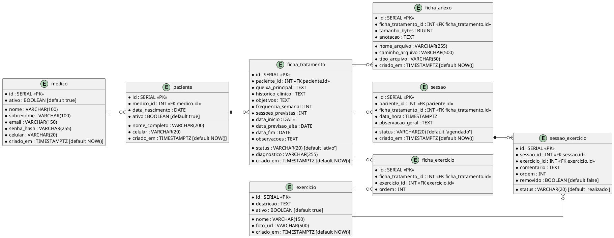

# Documentação do Banco de Dados

## Visão Geral

Banco de dados relacional **PostgreSQL** para o aplicativo de acompanhamento de pacientes por fisioterapeutas. O sistema permite login do médico/fisioterapeuta, cadastro de pacientes, gerenciamento de episódios de tratamento, sessões e anexos.

O **banco de exercícios** é compartilhado entre todos os fisioterapeutas e gerenciado pelo administrador do sistema.

O **prontuário** não é armazenado como um conjunto separado de tabelas. Ele é gerado sob demanda como relatório (PDF), compilando os dados da ficha de tratamento, sessões, exercícios e comentários do paciente.

---

## Diagrama ER (simplificado)



---

## Tabelas

### `medico`

Profissional que usa o sistema.

| Coluna | Tipo | Descrição |
|:---|:---|:---|
| id | SERIAL | PK |
| nome | VARCHAR(100) | Primeiro nome |
| sobrenome | VARCHAR(100) | Sobrenome |
| email | VARCHAR(150) | E-mail para login |
| senha_hash | VARCHAR(255) | Hash da senha |
| celular | VARCHAR(20) | Telefone |
| ativo | BOOLEAN | Conta ativa |
| criado_em | TIMESTAMPTZ | Data de criação |

---

### `paciente`

Paciente atendido pelo fisioterapeuta.

| Coluna | Tipo | Descrição |
|:---|:---|:---|
| id | SERIAL | PK |
| medico_id | INT | FK → medico.id |
| nome_completo | VARCHAR(200) | Nome completo |
| data_nascimento | DATE | Data de nascimento |
| celular | VARCHAR(20) | Telefone |
| ativo | BOOLEAN | Paciente ativo/inativo |
| data_cadastro | DATE | Data de cadastro |
| observacoes | TEXT | Observações gerais |
| criado_em | TIMESTAMPTZ | Data de criação |

---

### `ficha_tratamento`

Episódio de tratamento do paciente.

| Coluna | Tipo | Descrição |
|:---|:---|:---|
| id | SERIAL | PK |
| paciente_id | INT | FK → paciente.id |
| status | VARCHAR(20) | `ativo`, `concluido`, `cancelado` |
| queixa_principal | TEXT | Queixa principal |
| historico_clinico | TEXT | Histórico clínico |
| diagnostico | VARCHAR(255) | Diagnóstico |
| objetivos | TEXT | Objetivos terapêuticos |
| frequencia_semanal | INT | Sessões por semana |
| sessoes_previstas | INT | Total previsto |
| data_inicio | DATE | Início do tratamento |
| data_previsao_alta | DATE | Previsão de alta |
| data_fim | DATE | Término do tratamento |
| observacoes | TEXT | Observações do episódio |
| criado_em | TIMESTAMPTZ | Data de criação |

---

### `ficha_anexo`

Anexos do episódio de tratamento.

| Coluna | Tipo | Descrição |
|:---|:---|:---|
| id | SERIAL | PK |
| ficha_tratamento_id | INT | FK → ficha_tratamento.id |
| nome_arquivo | VARCHAR(255) | Nome original |
| caminho_arquivo | VARCHAR(500) | Caminho/URL |
| tipo_arquivo | VARCHAR(50) | MIME type |
| tamanho_bytes | BIGINT | Tamanho em bytes |
| anotacao | TEXT | Observação |
| criado_em | TIMESTAMPTZ | Data de upload |

---

### `exercicio`

Banco de exercícios compartilhado.

| Coluna | Tipo | Descrição |
|:---|:---|:---|
| id | SERIAL | PK |
| nome | VARCHAR(150) | Nome do exercício |
| descricao | TEXT | Descrição |
| foto_url | VARCHAR(500) | Imagem/URL |
| ativo | BOOLEAN | Disponível ou não |
| criado_em | TIMESTAMPTZ | Data de criação |

---

### `sessao`

Sessão agendada e registrada para um episódio de tratamento.

| Coluna | Tipo | Descrição |
|:---|:---|:---|
| id | SERIAL | PK |
| paciente_id | INT | FK → paciente.id |
| ficha_tratamento_id | INT | FK → ficha_tratamento.id |
| data_hora | TIMESTAMPTZ | Data e hora da sessão |
| status | VARCHAR(20) | `agendado`, `realizada`, `cancelada`, `nao_compareceu` |
| observacao_geral | TEXT | Observação da sessão |
| criado_em | TIMESTAMPTZ | Data de criação |

---

### `sessao_exercicio`

Registro dos exercícios feitos em cada sessão.

| Coluna | Tipo | Descrição |
|:---|:---|:---|
| id | SERIAL | PK |
| sessao_id | INT | FK → sessao.id |
| exercicio_id | INT | FK → exercicio.id |
| comentario | TEXT | Comentário sobre a execução |
| ordem | INT | Ordem na sessão |
| status | VARCHAR(20) | `realizado`, `nao_realizado`, `adaptado`, `superado` |
| removido | BOOLEAN | Excluído logicamente |

---

### `ficha_exercicio`

Exercícios previstos para o episódio de tratamento.

| Coluna | Tipo | Descrição |
|:---|:---|:---|
| id | SERIAL | PK |
| ficha_tratamento_id | INT | FK → ficha_tratamento.id |
| exercicio_id | INT | FK → exercicio.id |
| ordem | INT | Ordem sugerida |

---

## Fluxos principais

### Abertura de um episódio de tratamento

1. Criar paciente.
2. Criar `ficha_tratamento` com status `ativo`.
3. Adicionar exercícios em `ficha_exercicio`.
4. Adicionar anexos em `ficha_anexo` se necessário.

### Sessão

1. Criar `sessao` com `data_hora` e `status = 'agendado'`.
2. Ao iniciar a sessão, copiar exercícios de `ficha_exercicio` para `sessao_exercicio`.
3. Registrar comentários e atualizar `sessao_exercicio.status` se necessário.
4. No fim da sessão, atualizar `sessao.status = 'realizada'` ou outro status.

### Novo ciclo de tratamento

1. Encerrar a ficha atual (`ficha_tratamento.status = 'concluido'`).
2. Criar nova `ficha_tratamento` para o novo episódio.

---

## ex

```sql
SELECT * FROM ficha_tratamento WHERE paciente_id = :paciente_id AND status = 'ativo' ORDER BY criado_em DESC LIMIT 1;
```

```sql
SELECT * FROM sessao WHERE ficha_tratamento_id = :ficha_id ORDER BY data_hora;
```

```sql
SELECT se.* FROM sessao_exercicio se
JOIN sessao s ON s.id = se.sessao_id
WHERE s.ficha_tratamento_id = :ficha_id
ORDER BY s.data_hora, se.ordem;
```
