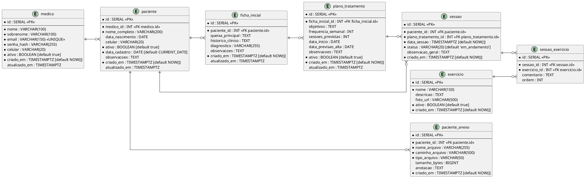

# Documentação do Banco de Dados

## Visão Geral

Banco de dados relacional **PostgreSQL** para o aplicativo de acompanhamento de pacientes por fisioterapeutas. O sistema permite login do médico/fisioterapeuta, cadastro de pacientes, ficha inicial, plano de tratamento, consulta ao banco compartilhado de exercícios (CRM) e sessões de fisioterapia.

O **banco de exercícios** é compartilhado entre todos os fisioterapeutas e gerenciado pelo administrador do sistema.

O **prontuário** não é armazenado no banco — ele é gerado sob demanda como relatório (PDF), compilando ficha inicial + plano de tratamento + sessões + exercícios + comentários. As sessões já formam o mapa de evolução do paciente.

---

## Diagrama ER (PlantUML)



---

## Tabelas

### 1. `medico`

Conta do profissional (fisioterapeuta). Usada para login e vínculo com todas as entidades.

| Coluna | Tipo | Restrições | Descrição |
|:---|:---|:---|:---|
| id | SERIAL | PK | Identificador único |
| nome | VARCHAR(100) | NOT NULL | Primeiro nome |
| sobrenome | VARCHAR(100) | NOT NULL | Sobrenome |
| email | VARCHAR(150) | NOT NULL, UNIQUE | E-mail para login |
| senha_hash | VARCHAR(255) | NOT NULL | Hash da senha (bcrypt/argon2) |
| celular | VARCHAR(20) | NOT NULL | Telefone celular |
| ativo | BOOLEAN | DEFAULT true | Conta ativa ou desativada |
| criado_em | TIMESTAMPTZ | DEFAULT NOW() | Data de criação da conta |
| atualizado_em | TIMESTAMPTZ | NULL | Última atualização |

> **Observação:** A senha nunca é armazenada em texto puro. Sempre utilizar hash com salt (bcrypt ou argon2).

---

### 2. `paciente`

Cadastro de pacientes vinculados a um médico.

| Coluna | Tipo | Restrições | Descrição |
|:---|:---|:---|:---|
| id | SERIAL | PK | Identificador único |
| medico_id | INT | FK → medico.id, NOT NULL | Médico responsável |
| nome_completo | VARCHAR(200) | NOT NULL | Nome completo do paciente |
| data_nascimento | DATE | NULL | Data de nascimento |
| celular | VARCHAR(20) | NULL | Telefone celular do paciente |
| ativo | BOOLEAN | DEFAULT true | Paciente ativo ou inativo |
| data_cadastro | DATE | DEFAULT CURRENT_DATE | Data em que foi cadastrado |
| observacoes | TEXT | NULL | Observações gerais sobre o paciente |
| criado_em | TIMESTAMPTZ | DEFAULT NOW() | Registro de criação |
| atualizado_em | TIMESTAMPTZ | NULL | Última atualização |

---

### 3. `paciente_anexo`

Tabela auxiliar para anexos de consultas externas do paciente (exames, laudos, etc.) com anotação.

| Coluna | Tipo | Restrições | Descrição |
|:---|:---|:---|:---|
| id | SERIAL | PK | Identificador único |
| paciente_id | INT | FK → paciente.id, NOT NULL | Paciente dono do anexo |
| nome_arquivo | VARCHAR(255) | NOT NULL | Nome original do arquivo |
| caminho_arquivo | VARCHAR(500) | NOT NULL | Caminho/URL de armazenamento |
| tipo_arquivo | VARCHAR(50) | NOT NULL | MIME type (ex: application/pdf, image/png) |
| tamanho_bytes | BIGINT | NULL | Tamanho do arquivo em bytes |
| anotacao | TEXT | NULL | Anotação/observação sobre o anexo |
| criado_em | TIMESTAMPTZ | DEFAULT NOW() | Data de upload |

---

### 4. `ficha_inicial`

Registro inicial do paciente. Documenta o motivo da consulta, queixa principal, histórico clínico e diagnóstico. Feito uma vez quando o paciente chega.

| Coluna | Tipo | Restrições | Descrição |
|:---|:---|:---|:---|
| id | SERIAL | PK | Identificador único |
| paciente_id | INT | FK → paciente.id, NOT NULL | Paciente |
| queixa_principal | TEXT | NULL | Motivo da consulta / queixa do paciente |
| historico_clinico | TEXT | NULL | Histórico clínico relevante |
| diagnostico | VARCHAR(255) | NULL | Diagnóstico (ex: CID, descrição clínica) |
| observacoes | TEXT | NULL | Observações adicionais |
| criado_em | TIMESTAMPTZ | DEFAULT NOW() | Data do registro |
| atualizado_em | TIMESTAMPTZ | NULL | Última atualização |

> Médico responsável é obtido via `paciente.medico_id`.

---

### 5. `plano_tratamento`

Plano terapêutico definido para o paciente. Define objetivos, frequência e previsão de alta.

| Coluna | Tipo | Restrições | Descrição |
|:---|:---|:---|:---|
| id | SERIAL | PK | Identificador único |
| ficha_inicial_id | INT | FK → ficha_inicial.id, NOT NULL | Ficha que originou este plano |
| objetivos | TEXT | NULL | Objetivos terapêuticos |
| frequencia_semanal | INT | NULL | Quantas sessões por semana |
| sessoes_previstas | INT | NULL | Total de sessões previstas |
| data_inicio | DATE | NULL | Data de início do tratamento |
| data_previsao_alta | DATE | NULL | Previsão de alta |
| observacoes | TEXT | NULL | Observações sobre o plano |
| ativo | BOOLEAN | DEFAULT true | Plano vigente ou encerrado |
| criado_em | TIMESTAMPTZ | DEFAULT NOW() | Data de criação |
| atualizado_em | TIMESTAMPTZ | NULL | Última atualização |

> **Nota:** Um paciente pode ter mais de um plano ao longo do tempo (ex: mudança de abordagem). O plano ativo é o que tem `ativo = true`. Paciente e médico são obtidos via `ficha_inicial → paciente → medico`.

---

### 6. `exercicio`

Banco de exercícios compartilhado (CRM). Cadastrado e gerenciado pelo administrador do sistema. Todos os fisioterapeutas têm acesso de leitura.

| Coluna | Tipo | Restrições | Descrição |
|:---|:---|:---|:---|
| id | SERIAL | PK | Identificador único |
| nome | VARCHAR(150) | NOT NULL | Nome do exercício |
| descricao | TEXT | NULL | Descrição detalhada |
| foto_url | VARCHAR(500) | NULL | URL da foto/imagem do exercício |
| ativo | BOOLEAN | DEFAULT true | Exercício disponível para uso |
| criado_em | TIMESTAMPTZ | DEFAULT NOW() | Data de criação |

---

### 7. `sessao`

Sessão/consulta de fisioterapia realizada com um paciente.

| Coluna | Tipo | Restrições | Descrição |
|:---|:---|:---|:---|
| id | SERIAL | PK | Identificador único |
| paciente_id | INT | FK → paciente.id, NOT NULL | Paciente atendido |
| plano_tratamento_id | INT | FK → plano_tratamento.id, NOT NULL | Plano de tratamento vinculado |
| data_sessao | TIMESTAMPTZ | DEFAULT NOW() | Data/hora da sessão |
| status | VARCHAR(20) | DEFAULT 'em_andamento' | Status da sessão: `em_andamento`, `finalizada`, `cancelada` |
| observacao_geral | TEXT | NULL | Observação geral da sessão |
| criado_em | TIMESTAMPTZ | DEFAULT NOW() | Registro de criação |

---

### 8. `sessao_exercicio`

Tabela associativa: exercícios realizados em cada sessão, com comentário individual.

| Coluna | Tipo | Restrições | Descrição |
|:---|:---|:---|:---|
| id | SERIAL | PK | Identificador único |
| sessao_id | INT | FK → sessao.id, NOT NULL | Sessão vinculada |
| exercicio_id | INT | FK → exercicio.id, NOT NULL | Exercício realizado |
| comentario | TEXT | NULL | Comentário sobre a execução (desempenho, observações) |
| ordem | INT | NULL | Ordem do exercício na sessão |

> **Constraint:** `UNIQUE(sessao_id, exercicio_id)` — impede exercício duplicado na mesma sessão.

---

## Prontuário (gerado sob demanda — sem tabela)

O prontuário **não é armazenado no banco**. Ele é um relatório gerado dinamicamente quando o médico solicita, compilando:

1. **Dados do paciente** (tabela `paciente`)
2. **Ficha inicial** (tabela `ficha_inicial`)
3. **Plano de tratamento** (tabela `plano_tratamento`)
4. **Sessões realizadas** (tabela `sessao` + `sessao_exercicio`) — este é o **mapa de evolução**
5. **Anexos** (tabela `paciente_anexo`)

O backend monta o documento em tempo real e exporta como **PDF**. Como todas as sessões já estão no banco, o mapa de evolução do paciente está sempre disponível e atualizado.

---

## Relacionamentos

```
medico 1 ──── N paciente
paciente 1 ──── N paciente_anexo
paciente 1 ──── N ficha_inicial
paciente 1 ──── N sessao            (desnormalizado para performance)
ficha_inicial 1 ──── N plano_tratamento
plano_tratamento 1 ──── N sessao
sessao 1 ──── N sessao_exercicio
exercicio 1 ──── N sessao_exercicio
```

---

## Índices recomendados

Para otimizar as consultas mais frequentes do sistema.

### Tipos de índice utilizados

- **Hash** — usado em buscas de igualdade exata (`WHERE coluna = ?`). Acesso direto O(1), ideal para buscar um único registro por ID ou chave única.  
- **B-tree** — usado em ranges (`<`, `>`, `BETWEEN`), ordenação (`ORDER BY`) e índices compostos. Padrão do PostgreSQL.

---

### Tabela de índices

| Tabela | Coluna(s) | Tipo | Fluxo de interface |
|:---|:---|:---|:---|
| `medico` | `email` | UNIQUE / Hash | Login do médico |
| `paciente` | `id` | PK / Hash | Abrir perfil de um paciente (clique na lista) |
| `paciente` | `medico_id` | B-tree | Listar todos os pacientes do médico logado |
| `paciente` | `(medico_id, ativo)` | B-tree composto | Listar pacientes ativos do médico |
| `paciente` | `nome_completo` | B-tree | Busca por nome na lista de pacientes |
| `paciente_anexo` | `paciente_id` | Hash | Listar anexos ao abrir perfil do paciente |
| `ficha_inicial` | `paciente_id` | Hash | Carregar ficha ao abrir perfil do paciente |
| `plano_tratamento` | `ficha_inicial_id` | Hash | Carregar plano a partir da ficha |
| `sessao` | `(paciente_id, data_sessao)` | B-tree composto | Histórico de sessões ordenado por data |
| `sessao` | `plano_tratamento_id` | Hash | Sessões de um plano específico |
| `sessao` | `status` | B-tree | Filtrar sessões por status |
| `sessao_exercicio` | `sessao_id` | Hash | Exercícios de uma sessão específica |
| `sessao_exercicio` | `(sessao_id, exercicio_id)` | UNIQUE / Hash | Impedir exercício duplicado na sessão |
| `exercicio` | `nome` | B-tree | Busca no banco de exercícios por nome |

---

### Scripts de criação dos índices

```sql
-- Hash (igualdade exata — acesso direto ao perfil)
CREATE INDEX idx_paciente_id_hash          ON paciente (id)                      USING HASH;
CREATE INDEX idx_paciente_anexo_hash       ON paciente_anexo (paciente_id)       USING HASH;
CREATE INDEX idx_ficha_paciente_hash       ON ficha_inicial (paciente_id)        USING HASH;
CREATE INDEX idx_plano_ficha_hash          ON plano_tratamento (ficha_inicial_id) USING HASH;
CREATE INDEX idx_sessao_plano_hash         ON sessao (plano_tratamento_id)       USING HASH;
CREATE INDEX idx_sessao_exercicio_hash     ON sessao_exercicio (sessao_id)       USING HASH;

-- B-tree (listagens, ranges, ordenação)
CREATE INDEX idx_paciente_medico_btree     ON paciente (medico_id);
CREATE INDEX idx_paciente_medico_ativo     ON paciente (medico_id, ativo);
CREATE INDEX idx_paciente_nome             ON paciente (nome_completo);
CREATE INDEX idx_sessao_paciente_data      ON sessao (paciente_id, data_sessao);  -- mais importante
CREATE INDEX idx_sessao_status             ON sessao (status);
CREATE INDEX idx_exercicio_nome            ON exercicio (nome);
```

---

### Consultas por fluxo de interface

#### Tela: Lista de pacientes do médico logado

```sql
-- Lista todos os pacientes ativos — usa idx_paciente_medico_ativo (B-tree)
SELECT id, nome_completo, data_nascimento, celular, data_cadastro
FROM paciente
WHERE medico_id = :medico_id AND ativo = true
ORDER BY nome_completo;
```

#### Tela: Busca de paciente por nome

```sql
-- Usa idx_paciente_nome (B-tree)
SELECT id, nome_completo, data_nascimento, celular
FROM paciente
WHERE medico_id = :medico_id AND nome_completo LIKE :busca
ORDER BY nome_completo;
-- :busca = 'Silva%'
```

#### Tela: Perfil completo do paciente (clique na lista)

Ao clicar em um paciente, o backend dispara as consultas abaixo em paralelo. Todas usam **Hash** — acesso direto por ID.

```sql
-- 1. Dados do paciente — Hash por PK
SELECT * FROM paciente WHERE id = :paciente_id;

-- 2. Ficha inicial — idx_ficha_paciente_hash
SELECT * FROM ficha_inicial WHERE paciente_id = :paciente_id ORDER BY criado_em DESC LIMIT 1;

-- 3. Plano de tratamento ativo — idx_plano_ficha_hash
SELECT pt.* FROM plano_tratamento pt
JOIN ficha_inicial fi ON fi.id = pt.ficha_inicial_id
WHERE fi.paciente_id = :paciente_id AND pt.ativo = true;

-- 4. Anexos do paciente — idx_paciente_anexo_hash
SELECT * FROM paciente_anexo WHERE paciente_id = :paciente_id ORDER BY criado_em DESC;
```

#### Tela: Histórico / mapa de evolução do paciente

```sql
-- Todas as sessões com exercícios, ordenadas por data — idx_sessao_paciente_data (B-tree composto)
SELECT s.id, s.data_sessao, s.status, s.observacao_geral,
       e.nome AS exercicio, se.comentario, se.ordem
FROM sessao s
JOIN sessao_exercicio se ON se.sessao_id = s.id   -- Hash
JOIN exercicio e ON e.id = se.exercicio_id
WHERE s.paciente_id = :paciente_id
ORDER BY s.data_sessao DESC, se.ordem;
```

#### Tela: Sessões de um plano específico

```sql
-- Usa idx_sessao_plano_hash (Hash)
SELECT s.data_sessao, s.status, s.observacao_geral, COUNT(se.id) AS total_exercicios
FROM sessao s
LEFT JOIN sessao_exercicio se ON se.sessao_id = s.id
WHERE s.plano_tratamento_id = :plano_id
GROUP BY s.id
ORDER BY s.data_sessao;
```

#### Tela: Banco de exercícios (busca por nome)

```sql
-- Usa idx_exercicio_nome (B-tree)
SELECT id, nome, descricao, foto_url
FROM exercicio
WHERE ativo = true AND nome LIKE :busca
ORDER BY nome;
-- :busca = 'Agachamento%'
```

---

## Fluxos do sistema

### Fluxo 1 — Primeiro acesso (médico se cadastra)

```
1. Médico acessa a tela de cadastro
2. Preenche: nome, sobrenome, email, senha, celular
3. Sistema cria registro em `medico` (senha é salva como hash)
4. Médico faz login com email + senha
```

**Exemplo:**
```
INSERT INTO medico (nome, sobrenome, email, senha_hash, celular)
VALUES ('Camila', 'Haab', 'camila@email.com', '$2b$12$...hash...', '11999998888');
```

---

### Fluxo 2 — Cadastro de paciente + ficha inicial

```
1. Médico acessa "Novo Paciente"
2. Preenche dados: nome completo, data de nascimento, celular
3. Sistema cria registro em `paciente`
4. Médico preenche a ficha inicial: queixa, histórico clínico, diagnóstico
5. Sistema cria registro em `ficha_inicial` vinculado ao paciente
6. (Opcional) Médico faz upload de anexos (exames, laudos)
7. Sistema cria registros em `paciente_anexo`
```

**Exemplo:**
```sql
-- Cadastra paciente
INSERT INTO paciente (medico_id, nome_completo, data_nascimento, celular)
VALUES (1, 'João da Silva', '1985-03-15', '11988887777');

-- Registra ficha inicial
INSERT INTO ficha_inicial (paciente_id, queixa_principal, historico_clinico, diagnostico)
VALUES (1, 'Dor no ombro direito há 3 meses', 'Sem cirurgias prévias, pratica musculação', 'Tendinite supraespinhal');

-- Anexa exame
INSERT INTO paciente_anexo (paciente_id, nome_arquivo, caminho_arquivo, tipo_arquivo, tamanho_bytes, anotacao)
VALUES (1, 'ressonancia_ombro.pdf', '/uploads/pacientes/1/ressonancia_ombro.pdf', 'application/pdf', 2048000, 'Ressonância de 10/03/2026 - confirma tendinite');
```

---

### Fluxo 3 — Definição do plano de tratamento

```
1. Médico acessa a ficha inicial do paciente
2. Cria um plano de tratamento vinculado àquela ficha
3. Define: objetivos, frequência semanal, sessões previstas, datas
```

**Exemplo:**
```sql
INSERT INTO plano_tratamento (ficha_inicial_id, objetivos, frequencia_semanal, sessoes_previstas, data_inicio, data_previsao_alta)
VALUES (1, 'Reduzir dor e restaurar amplitude de movimento do ombro direito', 3, 20, '2026-04-10', '2026-06-05');
```

---

### Fluxo 4 — Cadastro de exercícios (banco separado)

```
1. Médico acessa o "Banco de Exercícios" (independente de paciente)
2. Cadastra exercícios com nome, descrição e foto
3. Exercícios ficam disponíveis para uso em qualquer sessão
```

**Exemplo:**
```sql
INSERT INTO exercicio (medico_id, nome, descricao, foto_url)
VALUES
  (1, 'Pendular de Codman', 'Exercício pendular para mobilidade do ombro', '/uploads/exercicios/pendular.jpg'),
  (1, 'Rotação externa com faixa', 'Fortalecimento de rotadores externos', '/uploads/exercicios/rotacao_ext.jpg'),
  (1, 'Elevação frontal assistida', 'Elevação com bastão para ganho de amplitude', '/uploads/exercicios/elevacao.jpg');
```

---

### Fluxo 5 — Condução de uma sessão

```
1. Médico acessa o paciente e inicia nova sessão
2. Sistema cria registro em `sessao` com status 'em_andamento'
3. Médico seleciona exercícios do banco e adiciona à sessão
4. Para cada exercício, registra um comentário (como foi a execução)
5. Médico finaliza a sessão → status muda para 'finalizada'
```

**Exemplo:**
```sql
-- Inicia sessão
INSERT INTO sessao (paciente_id, plano_tratamento_id, data_sessao, status)
VALUES (1, 1, '2026-04-10 14:00:00+00', 'em_andamento');

-- Adiciona exercícios com comentários
INSERT INTO sessao_exercicio (sessao_id, exercicio_id, ordem, comentario) VALUES
  (1, 1, 1, 'Executou bem, sem dor durante o movimento'),
  (1, 2, 2, 'Dificuldade na rotação acima de 45°, dor leve'),
  (1, 3, 3, 'Amplitude de 120°, melhora em relação à avaliação');

-- Finaliza sessão
UPDATE sessao SET status = 'finalizada', observacao_geral = 'Paciente apresentou boa evolução. Manter frequência.' WHERE id = 1;
```

---

### Fluxo 6 — Acompanhamento da evolução (mapa de evolução)

```
1. Médico acessa a página do paciente
2. Visualiza todas as sessões em ordem cronológica
3. Para cada sessão, vê os exercícios realizados e comentários
4. Pode filtrar por plano de tratamento específico
5. Compara evolução ao longo do tempo
```

**Exemplo de consulta — todas as sessões de um paciente:**
```sql
SELECT s.data_sessao, s.status, s.observacao_geral,
       e.nome AS exercicio, se.comentario, se.ordem
FROM sessao s
JOIN sessao_exercicio se ON se.sessao_id = s.id
JOIN exercicio e ON e.id = se.exercicio_id
WHERE s.paciente_id = 1
ORDER BY s.data_sessao, se.ordem;
```

**Exemplo de consulta — sessões de um plano específico:**
```sql
SELECT s.data_sessao, s.observacao_geral, COUNT(se.id) AS total_exercicios
FROM sessao s
LEFT JOIN sessao_exercicio se ON se.sessao_id = s.id
WHERE s.plano_tratamento_id = 1
GROUP BY s.id
ORDER BY s.data_sessao;
```

---

### Fluxo 7 — Geração do prontuário (PDF sob demanda)

```
1. Médico acessa a página do paciente e clica em "Gerar Prontuário"
2. Backend consulta: paciente → ficha_inicial → plano_tratamento → sessões → exercícios
3. Monta documento compilado (HTML → PDF)
4. Médico visualiza na tela e/ou faz download
```

**Exemplo de consulta — dados completos para o prontuário:**
```sql
-- Dados do paciente
SELECT * FROM paciente WHERE id = 1;

-- Ficha(s) inicial(is)
SELECT * FROM ficha_inicial WHERE paciente_id = 1 ORDER BY criado_em;

-- Planos de tratamento
SELECT pt.* FROM plano_tratamento pt
JOIN ficha_inicial fi ON fi.id = pt.ficha_inicial_id
WHERE fi.paciente_id = 1
ORDER BY pt.data_inicio;

-- Todas as sessões com exercícios
SELECT s.data_sessao, s.status, s.observacao_geral,
       e.nome AS exercicio, se.comentario, se.ordem
FROM sessao s
JOIN sessao_exercicio se ON se.sessao_id = s.id
JOIN exercicio e ON e.id = se.exercicio_id
WHERE s.paciente_id = 1 AND s.status = 'finalizada'
ORDER BY s.data_sessao, se.ordem;

-- Anexos
SELECT * FROM paciente_anexo WHERE paciente_id = 1 ORDER BY criado_em;
```

---

### Fluxo 8 — Paciente retorna com nova queixa (novo ciclo)

```
1. Médico acessa paciente já existente (João da Silva)
2. Cria nova ficha inicial com a nova queixa
3. Cria novo plano de tratamento vinculado à nova ficha
4. Conduz novas sessões vinculadas ao novo plano
5. Sessões antigas permanecem intactas e separadas por plano
```

**Exemplo:**
```sql
-- Nova ficha (mesmo paciente, queixa diferente)
INSERT INTO ficha_inicial (paciente_id, queixa_principal, diagnostico)
VALUES (1, 'Dor lombar após esforço', 'Lombalgia mecânica');

-- Novo plano vinculado à nova ficha
INSERT INTO plano_tratamento (ficha_inicial_id, objetivos, frequencia_semanal, sessoes_previstas, data_inicio)
VALUES (2, 'Alívio da dor lombar e fortalecimento de core', 2, 15, '2026-09-01');

-- Sessões do novo ciclo
INSERT INTO sessao (paciente_id, plano_tratamento_id, data_sessao, status)
VALUES (1, 2, '2026-09-01 10:00:00', 'em_andamento');

-- Resultado no banco:
-- Plano 1 (ombro) → sessões 1 a 18
-- Plano 2 (lombar) → sessões 19 em diante
```