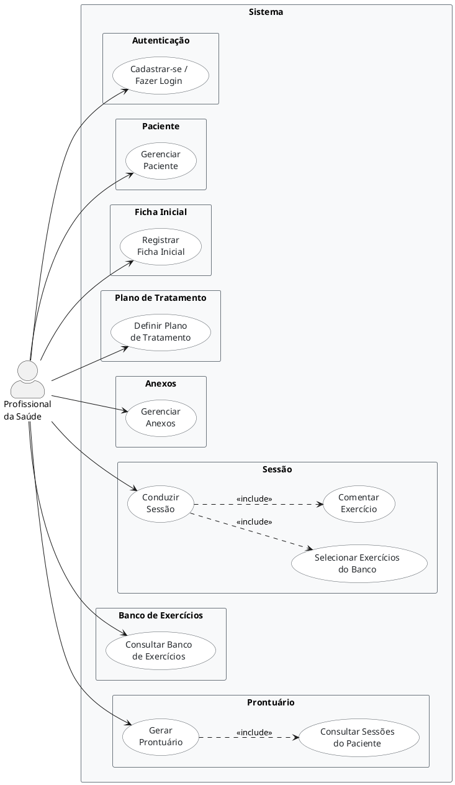

# Documentação do Projeto: Aplicativo para Profissionais da Saúde

## 1. Objetivo do Projeto

Desenvolver um aplicativo web para profissionais da saúde que permita cadastrar pacientes, conduzir sessões com uma bateria de exercícios comentada e, quando necessário, gerar automaticamente um prontuário do paciente com base nessas sessões.

O sistema gira em torno dos seguintes conceitos centrais:

1. **Médico** — cadastro e autenticação do profissional responsável.
2. **Paciente** — cadastro e dados do paciente, vinculado ao médico.
3. **Ficha Inicial** — registro do motivo da consulta, queixa principal, histórico clínico e diagnóstico.
4. **Plano de Tratamento** — objetivos terapêuticos, frequência semanal, sessões previstas e previsão de alta.
5. **Sessão** — atendimento realizado, com exercícios selecionados e comentários.
6. **Banco de Exercícios (CRM)** — banco compartilhado de exercícios, cadastrados pelo administrador do sistema, com nome, descrição e foto. Todos os fisioterapeutas têm acesso ao mesmo catálogo.
7. **Anexos** — exames, laudos e outros documentos do paciente.
8. **Prontuário** — relatório gerado sob demanda (PDF), compilando ficha inicial + plano de tratamento + sessões + exercícios + anexos. Não é armazenado no banco.

---

## 2. User Story

> **User Story:**
> Eu, Camila Haab, preciso de um aplicativo onde eu possa me cadastrar e fazer login. Depois, cadastro meus pacientes e preencho uma ficha inicial com queixa, histórico clínico e diagnóstico. Para cada paciente, defino um plano de tratamento com objetivos, frequência e previsão de alta. Inicio sessões de fisioterapia vinculadas ao plano, onde monto uma bateria de exercícios a partir do banco compartilhado de exercícios do sistema (com nome, descrição e foto) e registro um comentário em cada exercício realizado (como foi a execução, o desempenho, observações). Posso anexar exames e laudos ao paciente. Quando achar necessário, gero um prontuário em PDF que compila ficha inicial, plano de tratamento, todas as sessões realizadas, exercícios com comentários e anexos.

---

## 3. Módulos do Sistema

### 3.1 Autenticação (Médico)
- Cadastro do profissional: nome, sobrenome, e-mail, senha e celular.
- Login com e-mail e senha (senha armazenada como hash com salt — bcrypt/argon2).
- Todas as entidades do sistema são vinculadas ao médico logado.

### 3.2 Cadastro de Paciente
- Formulário com dados: nome completo, data de nascimento, celular e observações.
- Listagem de todos os pacientes do médico (filtro por ativos/inativos).
- Página individual do paciente com histórico de sessões, ficha inicial, plano de tratamento e anexos.

### 3.3 Ficha Inicial
- Registro inicial do paciente ao chegar: queixa principal, histórico clínico, diagnóstico e observações.
- Vinculada ao paciente.

### 3.4 Plano de Tratamento
- Definido a partir da ficha inicial do paciente.
- Contém: objetivos terapêuticos, frequência semanal, sessões previstas, data de início e previsão de alta.
- Um paciente pode ter mais de um plano ao longo do tempo (o vigente é o que está ativo).

### 3.5 Sessões
- Iniciar uma nova sessão vinculada a um paciente e ao plano de tratamento ativo.
- Montar a bateria de exercícios da sessão selecionando itens do banco de exercícios.
- Para cada exercício incluído, adicionar um comentário (execução, desempenho, observações).
- Status da sessão: `em_andamento`, `finalizada` ou `cancelada`.
- Encerrar e salvar a sessão com observação geral.
- Visualizar sessões anteriores com os exercícios e comentários registrados.
- As sessões formam o **mapa de evolução** do paciente.

### 3.6 Banco de Exercícios (CRM Compartilhado)
- Banco de exercícios compartilhado entre todos os fisioterapeutas cadastrados no sistema.
- Os exercícios são cadastrados e gerenciados pelo **administrador do sistema**, não pelos profissionais.
- Cada exercício tem: nome, descrição (opcional) e foto/imagem (opcional).
- Exercícios podem ser ativados/desativados pelo administrador.
- Os fisioterapeutas apenas consultam e selecionam exercícios do banco durante as sessões.

### 3.7 Anexos do Paciente
- Upload de arquivos relacionados ao paciente (exames, laudos, etc.).
- Cada anexo registra: nome do arquivo, caminho, tipo (MIME), tamanho e uma anotação opcional.

### 3.8 Prontuário
- **Não é armazenado no banco** — é gerado sob demanda como relatório (PDF).
- Compila: dados do paciente + ficha inicial + plano de tratamento + sessões realizadas + exercícios com comentários + anexos.
- O profissional decide quando gerar, acionando manualmente por um botão na página do paciente.
- O backend monta o documento em tempo real (HTML → PDF) e disponibiliza para visualização e download.

---

## 4. Telas Necessárias

| Tela | O que faz |
| :--- | :--- |
| **Cadastro / Login** | Cadastro do médico e autenticação (e-mail + senha) |
| **Dashboard** | Lista de pacientes do médico e acesso rápido às sessões recentes |
| **Paciente** | Dados do paciente + ficha inicial + plano de tratamento + histórico de sessões + anexos + botão para gerar prontuário |
| **Ficha Inicial** | Registro de queixa principal, histórico clínico e diagnóstico |
| **Plano de Tratamento** | Definição de objetivos, frequência, sessões previstas e previsão de alta |
| **Sessão** | Montagem da bateria de exercícios + campo de comentário por exercício + observação geral |
| **Banco de Exercícios** | Consulta e seleção de exercícios do catálogo compartilhado (somente leitura para o fisioterapeuta; cadastro feito pelo administrador) |
| **Anexos** | Upload e listagem de exames, laudos e outros documentos do paciente |
| **Prontuário** | Visualização do prontuário gerado (PDF) com opção de download |

---

## 5. Diagrama de Caso de Uso

**Ator:** Profissional da saúde

**Casos de uso e relações:**

| Caso de Uso | Relação | Inclui |
| :--- | :--- | :--- |
| Cadastrar-se / Fazer Login | — | — |
| Gerenciar Paciente | — | — |
| Registrar Ficha Inicial | — | — |
| Definir Plano de Tratamento | — | — |
| Conduzir Sessão | `<<include>>` | Selecionar Exercícios do Banco |
| Conduzir Sessão | `<<include>>` | Comentar Exercício |
| Consultar Banco de Exercícios | — | — |
| Gerenciar Anexos do Paciente | — | — |
| Gerar Prontuário | `<<include>>` | Consultar Sessões do Paciente |

**Diagrama (PlantUML):**

//usar alt+d para exibir diagrama

---

## 6. Software / Plataforma

| Camada | Tecnologias |
| :--- | :--- |
| **Frontend** | React, HTML, CSS, JavaScript |
| **Backend** | Python, FastAPI (API REST) |
| **Banco de Dados** | PostgreSQL |
| **Ferramentas** | Visual Studio Code, Git |

---

## 7. Cronograma do Projeto

As etapas devem ser seguidas na ordem abaixo:

**Etapa 1 — Análise e Documentação**
* Levantamento de requisitos com a profissional
* Definição dos módulos, telas e fluxos do sistema
* Elaboração da User Story e Diagrama de Caso de Uso
* Revisão e validação do documento base

**Etapa 2 — Prototipação**
* Criação dos wireframes das telas (Dashboard, Paciente, Sessão, Banco de Exercícios, Prontuário)
* Validação do fluxo de navegação com a profissional
* Ajustes no protótipo antes de iniciar o desenvolvimento

**Etapa 3 — Modelagem do Banco de Dados**
* Definição das entidades (Médico, Paciente, Paciente Anexo, Ficha Inicial, Plano de Tratamento, Exercício, Sessão, Sessão Exercício)
* Prontuário gerado sob demanda (sem tabela no banco)
* Criação do diagrama entidade-relacionamento (DER)
* Criação das tabelas no PostgreSQL
* Definição de índices para otimização de consultas

**Etapa 4 — Desenvolvimento do Backend**
* Configuração do projeto FastAPI
* Implementação dos endpoints de Paciente (cadastro, listagem, detalhes)
* Implementação dos endpoints de Sessão (criar, adicionar exercícios, comentar, encerrar)
* Implementação dos endpoints de Banco de Exercícios (listar, cadastrar)
* Implementação da geração do Prontuário

**Etapa 5 — Desenvolvimento do Frontend**
* Configuração do projeto React
* Implementação das telas na ordem: Dashboard → Paciente → Sessão → Banco de Exercícios → Prontuário
* Integração com a API (FastAPI)

**Etapa 6 — Testes**
* Testes dos fluxos principais (cadastrar paciente, conduzir sessão, gerar prontuário)
* Correção de bugs encontrados

**Etapa 7 — Entrega Final**
* Revisão geral do sistema
* Documentação final
* Deploy ou entrega do projeto

